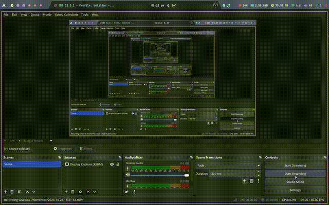

# 💡 Assignment 1 — Task (b)

**Name:** Haider Ali  
**Roll Number:** 23-NTU-CS-FL-1254  

---

## 🧠 Task Overview

In this task, the ESP32 uses **a single button** with **press-type detection** to control LEDs and a buzzer.  
- A **short press** toggles all three LEDs.  
- A **long press (> 1.5 seconds)** plays a buzzer tone.  
- The **OLED display** shows real-time feedback for each event.  

This demonstrates button debouncing, press duration detection, and I²C display handling on ESP32.

---

## ⚙️ Hardware Setup

| Component | ESP32 Pin | Function |
|------------|------------|-----------|
| Red LED | GPIO 4 | LED Output |
| Green LED | GPIO 2 | LED Output |
| Blue LED | GPIO 5 | LED Output |
| Buzzer | GPIO 27 | Buzzer Output |
| Button | GPIO 33 | Single Button Input |
| OLED SDA | GPIO 21 | I²C Data |
| OLED SCL | GPIO 22 | I²C Clock |

---

## 🎬 Demo (Silent Preview)

> 🔊 Want to hear the buzzer? [🎥 Watch the full video here](https://github.com/haider-ali-1254/Embedded_IOT/blob/master/assignment1-1254/Task%202%20-%20Short%20And%20Long%20Press/demo/demoB.mp4?raw=true)

---

## 🧩 Features

✅ Single-button press detection with debouncing  
✅ Short press toggles all three LEDs  
✅ Long press (> 1.5 s) triggers buzzer tone  
✅ OLED shows feedback message for each event  
✅ Clean, modular, and readable code  

---

## 🧾 Code Logic Summary

| Press Type | Duration | Action | OLED Message |
|-------------|-----------|---------|----------------|
| Short Press | < 1.5 seconds | Toggle all LEDs | “Short Press: LEDs Toggled” |
| Long Press | ≥ 1.5 seconds | Play buzzer tone | “Long Press: Buzzer ON” |

---

## 🧰 Libraries Used
- **Adafruit GFX Library**
- **Adafruit SSD1306 Library**
- **Wire (I²C)**

Install these via PlatformIO or Arduino Library Manager before uploading.

---

## 🚀 How to Run
1. Connect your ESP32 and open the project in **PlatformIO**.  
2. Upload the code from `src/main.cpp`.  
3. Observe the OLED for messages and interact using the button.  
4. Use a **short press** to toggle LEDs or a **long press** to hear the buzzer.

---

